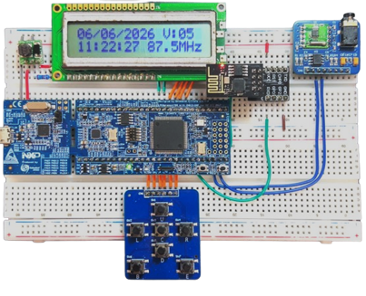
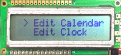
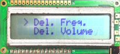
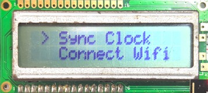
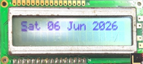
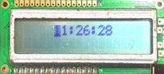

# Relatório do Projeto de Radio FM com Telemetria e Calendário — Grupo 08

**Departamento de Engenharia de Eletrónica e Telecomunicações e de Computadores**  
Licenciatura em Engenharia Eletrónica e Telecomunicações e de Computadores

**Sistemas Embebidos IoT**  
**Projeto - Radio FM com Telemetria e Calendário**  
**Relatório – Grupo 08**

Duarte Santos, Nº51764  
Rafael Vaz, Nº45887  
João Santos, Nº51009

6º Semestre letivo 2025/2026 — 13 de Junho de 2026

---

## Resumo

O presente relatório descreve o desenvolvimento da extensão IoT do projeto de Rádio FM com Calendário, realizado no âmbito da Unidade Curricular (UC) de Sistemas Embebidos IoT. O projeto anterior, desenvolvido na UC de Sistemas Embebidos, consistiu na implementação de um rádio FM autónomo, com interface de utilizador local baseada num LCD e num módulo de botões Nav7Btn, utilizando um driver de camadas sequencial e sem sistema operativo. Neste semestre, o sistema foi migrado para uma arquitetura baseada no FreeRTOS, adicionando conectividade Wi-Fi através do módulo ESP8266 via UART, sincronização automática de tempo por NTP e publicação de telemetria (volume e estação rádio) num broker MQTT. A transição para RTOS exigiu a criação de *wrappers* *thread-safe* para todos os drivers existentes (LCD, rádio, botões, relógio) com recurso a *mutex* e filas de mensagens, garantindo acesso concorrente seguro aos periféricos. O sistema resultante é capaz de sincronizar o relógio automaticamente com um servidor NTP, publicar periodicamente dados de telemetria via protocolo MQTT, e manter toda a funcionalidade do projeto anterior.

## Abstract

This report describes the development of the IoT extension of the FM Radio with Calendar project, carried out as part of the IoT Embedded Systems curricular unit (CU). The previous project developed for the Embedded Systems CU consisted of implementing an autonomous FM radio with a local user interface based on an LCD and a Nav7Btn button module, using a sequential layer driver with no operating system. In this semester, the system was migrated to a FreeRTOS-based architecture, adding Wi-Fi connectivity through the ESP8266 module via UART, automatic time synchronization via NTP, and telemetry publishing (volume and radio station) to an MQTT broker. The transition to RTOS required the creation of thread-safe wrappers for all existing drivers (LCD, radio, buttons, clock) using mutexes and message queues, ensuring safe concurrent access to peripherals. The resulting system is capable of automatically synchronizing the clock with an NTP server, periodically publishing telemetry data via the MQTT protocol, and maintaining all the functionality of the previous project.

---

## Índice

1. [Descrição do Trabalho e Visão Geral](#1-descrição-do-trabalho-e-visão-geral)
   - 1.1 [Fluxo Geral do Sistema e Montagem do Hardware](#11-fluxo-geral-do-sistema-e-montagem-do-hardware)
   - 1.2 [Modos de Funcionamento](#12-modos-de-funcionamento)
     - 1.2.1 [Menu de Manutenção](#121-menu-de-manutenção)
       - 1.2.1.1 [Edit Calendar e Edit Clock](#1211-edit-calendar-e-edit-clock)
       - 1.2.1.2 [Sync Clock – Sincronização NTP](#1212-sync-clock--sincronização-ntp)
       - 1.2.1.3 [Connect WiFi – Ligação ao Ponto de Acesso](#1213-connect-wifi--ligação-ao-ponto-de-acesso)
2. [Gestores e Abordagens Escolhidas](#2-gestores-e-abordagens-escolhidas)
   - 2.1 [Task de Inicialização](#21-task-de-inicialização)
   - 2.2 [Gestor do Display](#22-gestor-do-display)
   - 2.3 [Gestor dos Botões](#23-gestor-dos-botões)
   - 2.4 [Wrappers Thread-Safe com Mutex](#24-wrappers-thread-safe-com-mutex)
   - 2.5 [Sincronização do Tempo – NTP/UDP](#25-sincronização-do-tempo--ntpudp)
   - 2.6 [Publicação MQTT](#26-publicação-mqtt)
   - 2.7 [Menu de Manutenção](#27-menu-de-manutenção)
3. [Diagrama de Blocos do Projeto](#3-diagrama-de-blocos-do-projeto)
   - 3.1 [Arquitetura de Software em Camadas](#31-arquitetura-de-software-em-camadas)
     - 3.1.1 [Fluxo de Comunicação IoT](#311-fluxo-de-comunicação-iot)
4. [Conclusões](#4-conclusões)

---

## 1. Descrição do Trabalho e Visão Geral

O projeto anterior (Rádio FM com Calendário), realizado na UC de Sistemas Embebidos, entregou um sistema funcional com receção FM (RDA5807M via I2C), relógio e calendário (RTC da placa LPC1769), interface LCD e 7 botões de navegação, memória flash para armazenamento da frequência e volume e uma arquitetura de software em camadas (Hardware → CMSIS-CORE → Drivers → Middleware → Aplicação).

O presente projeto (Radio FM com Telemetria e Calendário), realizado no âmbito da UC de Sistemas Embebidos IoT, mantém toda a base de hardware e software anterior, acrescentando as seguintes novidades:

- Execução concorrente com FreeRTOS sobre o mesmo microcontrolador LPC1769;
- Conectividade Wi-Fi via módulo ESP8266 por UART com comandos AT;
- Sincronização automática de relógio via protocolo NTP (pool.ntp.org);
- Publicação periódica de telemetria (volume e estação FM) via MQTT;
- Wrappers RTOS-safe para todos os drivers partilhados entre tasks.

**Tabela 1 – Novos Periféricos e a sua Descrição**

| Periférico/Componente | Descrição / Papel no Sistema |
|---|---|
| ESP8266 | Módulo Wi-Fi que comunica com o LPC1769 via UART por comandos AT. Responsável pela ligação à rede, abertura de sockets UDP/TCP, envio e receção de dados. |
| UART | Interface série de comunicação entre o LPC1769 e o ESP8266. |
| Broker MQTT | Servidor externo que recebe a telemetria do dispositivo (identificado como SEIOT-2025-2026-G08). |
| NTP (pool.ntp.org) | Servidor de tempo em protocolo NTP/UDP para sincronização automática do RTC no arranque do sistema. |

### 1.1 Fluxo Geral do Sistema e Montagem do Hardware

No arranque do sistema, a task principal (APP_Task) inicializa sequencialmente todos os módulos: LCD, botões, Wi-Fi, ligação ao ponto de acesso, sincronização NTP, relógio (RTC), rádio FM e publicação MQTT. Após a inicialização, o menu principal fica ativo aguardando interação do utilizador, enquanto a task publisher envia telemetria periodicamente e a task Display_Manager gere todas as escritas no LCD.

  
  
<em>Figura 1 – Visão Geral da Montagem em breadboard</em>

### 1.2 Modos de Funcionamento

O sistema apresenta dois modos principais de funcionamento: o **Modo Normal**, onde o LCD exibe continuamente a data, hora, volume e frequência FM; e o **Modo de Manutenção**, acessível pressionando o botão Enter (**E**), onde estão disponíveis as opções de configuração do sistema.

#### 1.2.1 Menu de Manutenção

O menu de manutenção é composto por três pares de opções navegáveis com os botões Up/Down. O cursor ">" na linha superior indica a opção atualmente selecionada. As primeiras duas opções (Edit Calendar e Edit Clock) permitem editar a data e hora manualmente. As seguintes (Del. Freq. e Del. Volume) permitem apagar os valores guardados em flash. As duas últimas opções (Sync Clock e Connect WiFi) permitem sincronizar o relógio via NTP e reconectar o módulo Wi-Fi, respetivamente.

<table>
  <tr>
    <td align="center">
      
       
      <em>Figura 2 – Menu: Edit Calendar e Edit Clock</em>
    </td>
    <td align="center">
      
       
      <em>Figura 3 – Menu: Del. Freq e Del. Volume</em>
    </td>
    <td align="center">
      
       
      <em>Figura 4 – Menu: Sync Clock e Connect WiFi</em>
    </td>
  </tr>
</table>

##### 1.2.1.1 Edit Calendar e Edit Clock

Ao selecionar a opção **Edit Calendar**, o LCD passa a mostrar a data completa no formato "Dia-da-semana DD MÊS AAAA", permitindo ao utilizador editar cada campo individualmente com os botões Left/Right (seleção do campo) e Up/Down (incremento/decremento). A opção **Edit Clock** funciona de forma análoga, mas para a hora, exibindo em formato "HH:MM:SS". Em ambos os casos, o botão Enter confirma e guarda as alterações na memória flash, enquanto o botão Back cancela sem guardar.

  <table>
    <tr>
      <td align="center">
        
         
        <em>Figura 5 – Edit Calendar</em>
      </td>
      <td align="center">
        
         
        <em>Figura 6 – Edit Clock</em>
      </td>
    </tr>
  </table>

##### 1.2.1.2 Sync Clock – Sincronização NTP

A opção **Sync Clock** desencadeia uma sincronização manual do relógio via protocolo NTP. Durante o processo, o LCD exibe a mensagem "Synchronizing time…" enquanto o sistema abre um socket UDP para a pool.ntp.org na porta 123, envia o pacote de pedido NTP e aguarda a resposta. Após receber o timestamp do servidor, o sistema converte-o para hora local (UTC+1) e atualiza o RTC do LPC1769 em tempo real.

*Figura 7 – LCD durante a sincronização NTP*

##### 1.2.1.3 Connect WiFi – Ligação ao Ponto de Acesso

A opção **Connect WiFi** permite reconectar o módulo ESP8266 ao ponto de acesso configurado (SSID e password definidos em tempo de compilação). Durante o processo de ligação, o LCD apresenta "Connecting to AP: \<SSID\>…". Quando a ligação é estabelecida com sucesso, a mensagem muda para "Connected to AP: \<SSID\>", indicando que o módulo Wi-Fi está pronto para comunicar com o broker MQTT e o servidor NTP.

*Figuras 8 e 9 – Mensagem de Ligação ao AP | Mensagem de Conectado ao AP*

---

## 2. Gestores e Abordagens Escolhidas

A migração para FreeRTOS implicou decompor o loop principal sequencial numa coleção de tasks independentes e concorrentes como apresentado na Tabela 2. Cada task tem responsabilidade única, prioridade definida e comunicação com as restantes por mecanismos de sincronização do *kernel*.

**Tabela 2 – Descrições das Tasks Criadas**

| Task | Aplicação |
|---|---|
| APP_Task | Task de arranque. Inicializa todos os módulos em sequência e lança o menu principal, terminando após a inicialização. |
| DISPLAY_Manager | Consome itens da fila, sendo a única task que acede diretamente ao controlador do LCD. |
| Publisher_Task | Gera o ciclo completo de ligação MQTT sobre TCP via ESP8266. Publica o volume e a estação FM a cada 30 segundos. |
| MenuTask | Gere o Menu Principal, o Modo de manutenção e o Sync Clock, processa a navegação e as ações do utilizador. |
| BtnScan | Timer de software FreeRTOS com delay de 100ms. Lê o estado do Nav7Btn e coloca eventos do botão numa fila. |

### 2.1 Task de Inicialização

A APP_Task é a primeira task do código e tem como objetivo inicializar todo o sistema antes de entrarmos no funcionamento normal. O diagrama da Figura 10 demonstra a sequência de inicialização: arranque da Display Task, arranque da Button Timer Task, inicialização do Wi-Fi (modo estação e ligação ao ponto de acesso) e tentativa de ligação ao servidor NTP.

Caso a ligação NTP seja bem-sucedida, o RTC é inicializado com o tempo recebido do servidor. Em caso de falha, o sistema tenta inicializar o RTC com o tempo guardado previamente na memória flash; se esta informação também não existir, recorre ao *built-in time* como último recurso. Assim garantimos que o relógio tem sempre um valor válido, mesmo sem ligação à rede. Após a inicialização do RTC, é inicializado o módulo de rádio, arrancando assim a Publisher Task e, por fim, lança o Menu Principal, que corre indefinidamente.

*Figura 10 – Fluxograma da APP_Task (Inicialização do sistema)*

### 2.2 Gestor do Display

O LCD é um recurso partilhado. A abordagem escolhida foi implementar um *producer-consumer*: qualquer task que queira escrever no LCD envia um objeto do tipo `DISPLAY_Item` para uma fila (`xQueueSend`). A task DISPLAY_Manager consome os itens da fila e executa as operações no LCD. Esta abordagem elimina a necessidade de *mutex* no acesso ao LCD e permite que múltiplas tasks escrevam sem bloqueio.

Como ilustrado na Figura 11, a task inicia por limpar o LCD e posicionar o cursor em (0, 0). Em seguida, verifica a *flag* de inicialização e recebe o próximo item da fila. O campo "id" de cada item é avaliado por um switch que o distingue entre quatro tipos de operação: `WRITE_STR` (escrita de string), `CURSOR_SET` (posicionar cursor), `WRITE_CMD` (comando direto) e `CLEAR` (limpar ecrã). Caso o identificador não corresponda a nenhum destes (`DEFAULT`), o item é ignorado e a task volta a aguardar por um novo.

*Figura 11 – Fluxograma da Display Task*

### 2.3 Gestor dos Botões

A leitura dos botões é feita por um timer de 100ms (`BTN_SCAN_PERIOD_MS`). Na *callback* do timer, o estado dos botões é lido e, se algum estiver pressionado, o evento é colocado numa fila (`xQueueSend`). As tasks que precisam de input chamam `BUTTON_Pressed()` que tenta receber da fila, sem bloquear, retornando `NAVBTN_NONE` se não houver eventos pendentes.

A Figura 12 demonstra a arquitetura descrita: numa primeira fase a task cria a fila (`xQueue`) e o temporizador (`xTimer`) iniciando-o. De seguida, o `xTimer` a cada iteração de 100ms chama `NavBTN_Pressed()` para verificar o estado dos botões. Se retornar `NAVBTN_NONE`, a execução do temporizador termina. Caso seja retornado `NAVBTN_*` (onde * corresponde ao botão pressionado), esse evento é enviado para a fila `xQueue`, ficando assim disponível para as tasks que aguardam algum input, como é o exemplo da MenuTask.

*Figura 12 – Fluxograma da Button Timer Task*

### 2.4 Wrappers Thread-Safe com Mutex

Para os drivers com estado interno partilhável (Wi-Fi, Rádio, Relógio), foi criado um padrão de wrapper baseado em macros definidas em `mutex_wrapper.h` (Tabela 3). Cada módulo declara `LOCK_DEF` (um `SemaphoreHandle_t` estático), inicializado com `LOCK_INIT()` na função de init. As secções críticas são delimitadas com `LOCK()` / `UNLOCK()`. O padrão `INIT_CHECK()` / `INIT_NCHECK()` garante que as funções retornam `NOT_INITIALIZED()` se forem chamadas antes da inicialização.

**Tabela 3 – Wrappers Desenvolvidos**

| Wrapper | Descrição |
|---|---|
| WIFI_RTOS | Wrapper thread-safe para todos os comandos AT ao ESP8266 via UART. |
| RADIO_RTOS | Wrapper para Set_Volume, Set_Channel, Save/Get_RData e acesso a registos I2C do RDA5807. |
| CLOCK (RTC) | Wrapper para RTC_GetTimeDate, RTC_SetTimeDate, RTC_GetSeconds e RTC_SetSeconds. |

### 2.5 Sincronização do Tempo – NTP/UDP

A sincronização de tempo é feita através do protocolo NTP. No arranque, o sistema abre um socket UDP para `pool.ntp.org` na porta 123, envia um pacote NTP de 48 bytes (`byte[0] = 0xE3`, LI=3, Version=4, Mode=3) e aguarda a resposta. O timestamp de transmissão (bytes 40–43, big-endian) é convertido de NTP epoch (1 de Janeiro de 1900) para Unix epoch subtraindo 2 208 988 800 segundos, com ajuste de fuso horário de +3600 segundos (UTC+1, Portugal continental).

O valor obtido é passado diretamente ao RTC via `CLOCK_SetSeconds()`, sincronizando o RTC. Esta operação também pode ser repetida manualmente, por via do menu de manutenção "Sync Clock".

### 2.6 Publicação MQTT

A telemetria é publicada no broker MQTT com o token do dispositivo `"SEIOT-2025-2026-G08"`. A task Publisher implementa uma máquina de estados explícita com os seguintes estados:

- **INIT** — conectar TCP;
- **CONNECT** — enviar MQTT CONNECT;
- **WAIT_CONNECT** — aguardar CONNACK;
- **SUBSCRIBE** — subscrever tópico de atributos;
- **SUBSCRIBE_SUBACK** — aguardar confirmação;
- **SUBSCRIBE_RECEIVE** — aguardar mensagens;
- **PUBLISH** — publicar telemetria.

A cada 30 segundos (utilizando `DELAY_GetElapsedMillis`), o sistema publica no tópico `v1/devices/me/telemetry` um payload JSON com o volume atual e frequência de estação em MHz, e.g., `"volume:8, station:97.4"`.

A camada de transporte usa a biblioteca MQTTPacket para serialização/deserialização dos pacotes MQTT, sobre um socket TCP gerido pelo wrapper WIFI_RTOS. Um buffer circular interno (`RECV_BUF_SIZE`) garante que dados recebidos em múltiplos fragmentos TCP são corretamente remontados.

*Figura 13 – Fluxograma da Publisher Task*

### 2.7 Menu de Manutenção

O menu de manutenção foi estendido com duas novas opções em relação ao semestre anterior, integrando assim as funcionalidades IoT na interface de utilizador existente:

- **"Sync Clock"** → Desencadeia uma nova sincronização NTP manual, atualizando o RTC em tempo real;
- **"Connect WiFi"** → Permite reconectar ao ponto de acesso configurado (SSID/password em tempo de compilação).

As restantes opções (Edit Calendar, Edit Clock, Del.Freq., Del. Volume) mantêm o comportamento do semestre anterior.

A Figura 14 mostra o fluxograma completo da MenuTask, dividido em três blocos. No bloco **Main Menu**, o sistema mostra continuamente o dia, o volume, a hora e a frequência, simultaneamente verificando o estado dos botões: Up/Down altera o volume, Left/Right altera a frequência, Center guarda a frequência e o volume na flash, e Enter entra em Modo de Manutenção.

No bloco **Maintenance Mode**, o sistema apresenta as opções disponíveis, permitindo ao utilizador navegar entre elas com Up/Down. Ao premir Enter, seleciona a opção: Edit Clock, Edit Calendar, Del. Volume, Del. Freq., Sync Clock ou Connect WiFi. Todas estas ações após utilizadas convergem em Exit Maintenance Mode, regressando ao Main Menu.

Por fim, o bloco **Sync Clock** demonstra o procedimento de sincronização NTP descrito anteriormente.

*Figura 14 – Fluxograma da MenuTask*

---

## 3. Diagrama de Blocos do Projeto

O hardware base é idêntico ao do semestre anterior: LPC1769 como microcontrolador, Módulo Radio FM RDA5807 por I2C, LCD de 8 bits, módulo Nav7Btn com 7 botões e conversor StepUp para alimentação do LCD. Como novidade, temos a adição do módulo ESP8266 conectado ao LPC1769 por UART.

*Figura 15 – Diagrama de Blocos do Projeto*

### 3.1 Arquitetura de Software em Camadas

A arquitetura do semestre anterior foi conservada e estendida com uma nova camada de wrappers RTOS-safe que medeia o acesso concorrente aos drivers. O FreeRTOS posiciona-se ao nível do sistema operativo, acima do CMSIS-CORE e abaixo dos wrappers como demonstra a Tabela 4.

**Tabela 4 – Diagrama de Camadas da Implementação Realizada**

| Camada | Componentes |
|---|---|
| **Application Layer** | `task_app.c` — ponto de entrada, orquestração do arranque |
| **Application Framework** | `Menu.c`, `menu_rtos.c` — fluxo de interface, máquinas de estados de menu |
| **Middleware / IoT** | `publisher.c`, `time_sync.c`, `transport.c`, `radio_rtos.c` — lógica de negócio IoT |
| **RTOS Wrappers** | `display.c`, `clock.c`, `button.c`, `wifi_rtos.c` — wrappers thread-safe com mutex/filas |
| **Drivers (HAL)** | `Radio.c`, `LCD.c`, `Nav7Btn.c`, `RTC.c`, `Flash.c`, `I2C.c`, `Wifi.c`, `uart.c` |
| **CMSIS-CORE + FreeRTOS** | `core_cm3`, `LPC17xx`, FreeRTOS kernel (tasks, queues, semaphores, timers) |
| **Hardware** | LPC1769, RDA5807M, LCD MC1602C, Nav7Btn, ESP8266, Flash interna |

#### 3.1.1 Fluxo de Comunicação IoT

O diagrama seguinte resume o fluxo de comunicação entre os componentes IoT do sistema implementado.

*Figura 16 – Diagrama de Fluxo de Comunicação IoT*

---

## 4. Conclusões

O projeto de Radio FM com Telemetria e Calendário representa uma evolução significativa do sistema desenvolvido no semestre anterior, mantendo toda a funcionalidade original do projeto de Radio FM com Calendário (realizado na UC de Sistemas Embebidos) e acrescentando conectividade IoT. A migração para FreeRTOS exigiu a reestruturação de todos os módulos de acesso a periféricos e a introdução de mecanismos de sincronização adequados.

A abordagem de *wrappers* thread-safe revelou-se eficaz para proteger recursos partilhados sem introduzir complexidade acrescida, permitindo que os drivers originais fossem reutilizados sem modificação. O gestor de display baseado em filas eliminou completamente a necessidade de mutex no periférico mais acedido concorrentemente, demonstrando assim as vantagens do producer-consumer em sistemas embebidos. A integração do NTP foi implementada de raiz sobre o protocolo UDP, sem recorrer a bibliotecas externas específicas de NTP.

A publicação MQTT implementou um cliente de raiz com a biblioteca MQTTPacket para a serialização de pacotes, gerindo o ciclo completo de ligação TCP, handshake MQTT, subscrição e publicação periódica. A máquina de estados do Publisher_Task garante recuperação automática em caso de perda de ligação.

Em suma, os objetivos propostos foram cumpridos: o sistema é funcional e mantém a base sólida do semestre anterior, construindo um projeto completo e bem estruturado.

---

*Duarte Santos Nº51764 | Rafael Vaz Nº45887 | João Santos Nº51009*
